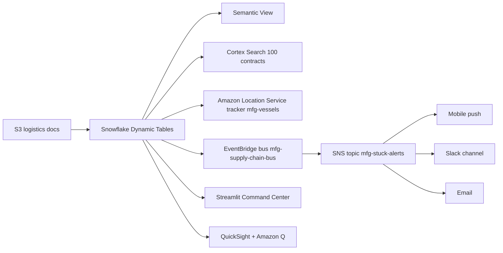

# Supply Chain Command Center

Real-time supply chain visibility powered by Snowflake Cortex AI — from raw logistics data to intelligent recommendations in minutes.

## Architecture

A geo-aware logistics control tower built on **Snowflake** (Dynamic Tables, Cortex Search, Cortex Analyst, semantic view) and **AWS** (S3, Amazon Location Service, EventBridge, SNS, QuickSight + Amazon Q). Three Pacific Express vessels stuck in the Singapore PSA approach geofence; the alert fans out to mobile, email, and Slack in one EventBridge rule.




## Snowflake Capabilities

| Capability | Implementation |
|-----------|---------------|
| Dynamic Tables | SHIPMENT_STATUS / CARRIER_PERFORMANCE / PORT_CONGESTION |
| ML Functions | ML.FORECAST (transit time) + ML.ANOMALY_DETECTION (delay) |
| Cortex Search | 100 logistics contracts and procedures indexed |
| Cortex Agent | SupplyChainAnalyst + LogisticsSearch tools |
| Semantic View | 11 dimensions, 9 metrics over 3 curated tables |
| Streamlit | Multi-page Command Center: Overview / Carrier / Port / Stuck / Search / Ask |

## AWS Services

| Service | Role in Demo |
|---------|-------------|
| Amazon S3 | Logistics document and data feed storage |
| Amazon Location Service | Real-time vessel tracking (mfg-vessels tracker) |
| Amazon EventBridge | Event-driven stuck-shipment alerting |
| Amazon SNS | Multi-channel alert fanout (email, SMS, Slack) |
| Amazon QuickSight | Executive supply chain KPI dashboard |
| Amazon Q | Natural language analytics for VP Supply Chain |

## Personas

| Persona | Role | Key Questions |
|---------|------|---------------|
| **Sarah Chen** | Global Logistics Director | Where are my stuck shipments? Which carriers are underperforming? |
| **James Park** | VP Supply Chain | What's our overall on-time rate? Where should we invest? |

## Data

| Table | Rows | Description |
|-------|------|-------------|
| SHIPMENTS | 50,000 | Global shipment tracking with status and delays |
| CONTAINERS | 100,000 | Container-level detail and routing |
| CARRIERS | 30 | Carrier performance profiles |
| PORTS | 20 | Port utilization and congestion metrics |
| WAREHOUSES | 15 | Distribution center inventory levels |
| SUPPLY_CHAIN_DOCS | 100 | Logistics procedures and policies |

## Build Instructions

### Prerequisites
- Snowflake account with ACCOUNTADMIN access
- Cortex AI enabled (ML Functions, Search, Agent)
- Warehouse: CORTEX (Medium)

### Deployment

```bash
# Execute SQL files in order
snowsql -f snowflake/00_setup.sql
snowsql -f snowflake/01_raw_tables.sql
snowsql -f snowflake/02_staging.sql
snowsql -f snowflake/03_dynamic_tables.sql
snowsql -f snowflake/04_search.sql
snowsql -f snowflake/05_ml_models.sql
snowsql -f snowflake/06_semantic_view.sql
snowsql -f snowflake/07_agent.sql
```

### Streamlit App
```
MANUFACTURING_SUPPLY_CHAIN.APP.SUPPLY_CHAIN_COMMAND_CENTER
```

## Build Modes

### Snowflake Only
Run the SQL scripts in `snowflake/` (skip `01_integrations.sql`) and deploy the Streamlit app from `streamlit/deploy/`. Uses Cortex AI instead of Bedrock, and Snowflake Intelligence instead of QuickSight.

### Full AWS + Snowflake
Run all SQL scripts including `01_integrations.sql`, deploy the main Streamlit app from `streamlit/`, then run the QuickSight setup from `quicksight/`.

## Key Demo Numbers

- **50,000** shipments tracked globally
- **3** containers stuck at Singapore PSA
- **12** downstream shipments delayed
- **94%** Singapore port utilization (critical)
- **62%** Pacific Express Lines on-time rate (worst carrier)

## License

Apache 2.0 — See [LICENSE](LICENSE) for details.
This is a personal project and is not an official Snowflake offering. It comes with no support or warranty. Use it at your own risk. Snowflake has no obligation to maintain, update, or support this code. Do not use this code in production without thorough review and testing.
